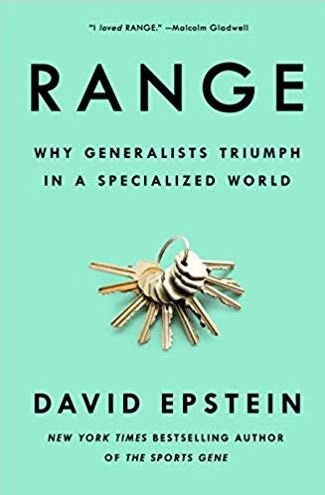

这个假期看了一本书，说尝试过其他专业行业的人更容易在某个行业取得成绩，因为有试错期更容易了解自己真正愿意从事的事情，这样就越容易坚持和付出努力，所以不要害怕起步晚，还说了人要有跨界思维，这样才能够多角度去思考问题。 建议年轻人给自己留足够的尝试时间，不要过早定型。

这个倒是让我想到两件事，一个是很好奇，如果一个人没看过这本书，如何在年轻时候就能意识到这点并去执行。 一个是想到我初中有个同学中考本来是通过了美术特长高中的专业考试，但是最后还是没去做特长生(记得那时候她说的原因是家人意见不宜过早定型)，后来大学时期动漫社搞得有声有色，研究生时期就去学习了动画，最后还是做了跟这相关的工作，拿过很多国际奖项，现在是一名非常优秀的动画导演和独立动画策展人。所以说，这也是自己的兴趣被激发而为所以能够取得成绩。

不管是不是年轻人，还是不要被外界某些观点束缚，错过了自己热爱的事业，那样就挺可惜的。

